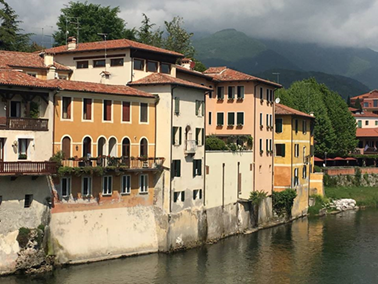

Bassano Del Grappa
==================

Background
----------

    There are four main things that Bassano is known for: its covered 
    bridge over the Brenta, the strong grappa liqueur, the military 
    history, and the locally produced ceramics.

    The most famous landmark in Bassano is the beautiful bridge called the 
    Ponte degli Aplini. This covered wooden bridge over the Brenta river 
    was designed in 1569 to replace earlier incarnations. The bridge has 
    been rebuilt and remodeled multiple times since.

..  Add background information on city

Location
--------

    Bassano Del Grappa is a city located in the Vicenza province, in the 
    region Veneto in northern Italy. It is a medium-sized town with a 
    population of 40,000. The town is situated at the point where the
    flat Veneto plains reach the hills leading up to the Alps.

..  Add location information on city

Special Facts about Bassano
---------------------------

    As noted above, Bassano is famous for the alcoholic product called 
    grappa. This liqueur is made from leftovers of the wine making process. 
    The Museo della Grappa showcases Bassano’s historic distilleries. 

    There are multiple bars around Bassano where one can buy sandwiches, 
    light meals, and drinks. Most of the restaurants feature local 
    specialties like asparagus and local wines. Apart from grappa, 
    Bassano is well known for its white asparagus, which is celebrated 
    in April with various culinary events.

..  Change name to special thing of city

..  image code

Below are the hours of operation to the highly recommended restaurant "Cardellino."

=========  =================
Day        Times           
=========  =================  
Monday     12-2pm, 6:30-10pm     
Tuesday    12-2pm, 6:30-10pm   
Wednesday  12-2pm, 6:30-10pm   
Thursday    Closed    
Friday     12-2pm, 6:30-10pm     
Saturday   12-2pm, 6:30-10pm    
Sunday     12-2pm, 6:30-10pm  
=========  =================  

..  Table Code

This is a link to the official website of `Cardellino <http://www.ristorantecardellino.it/il-ristorante>`_.

.. Link Code
