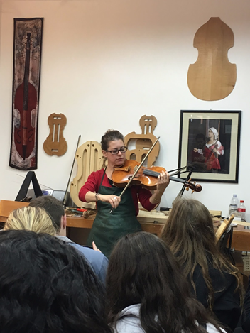

Cremona
=======

Background
----------

    Cremona, Italy, is rich with historic and artistic treasures located 
    between Lombardy and Emilia Romagna. The Piazza del Comune is in the 
    heart of the city, which is home to most of the historic sights. 

    Cremona is famous for the violins and violas that were handmade in the 
    16th-18th centuries by the Amanti family. The city’s most famous violin 
    maker was Antonio Stradivari. Stradivarious violins continue to be known 
    as the best in the world today. Violins and violas are still handmade 
    and tailored to each specific customer to this day. When you walk the 
    streets of Cremona you will find multiple violin workshops. 

..  Add background information on city

Location
--------

    Cremona is a city and comune in northern Italy, located in Lombardy, on 
    the left bank of the Po River. It is the capital of the province of 
    Cremona and the seat of the local city and province governments.  

..  Add location information on city

Special Facts about Cremona
---------------------------

    Cremona is at the center of the Pro Valley, one of Italy’s top food 
    producing areas. Grana Padano and provolone cheese are produced in 
    Cremona as well as special salami made from pork. The torrone, or 
    nougat, is also famous in Cremona. Torrone is a crunchy or chewy treat 
    with almonds that’s celebrated in November at the Festa del Torrone. 

..  Change name to special thing of city

..  image code

