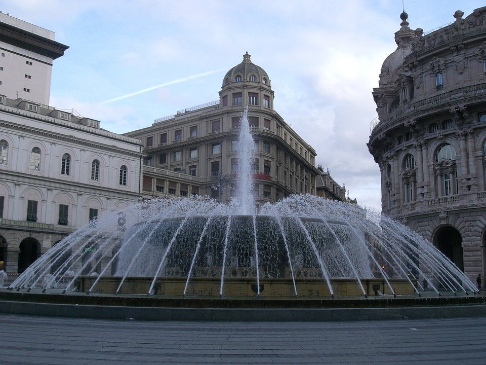

Genoa
=====

Background
----------

Genoa Italy is located in Northwest Italy on the coast of the Gulf of Genoa. It is the sixth largest city in Italy and is home for over 1.5 million people. Genoa has always been one of the busiest and most important ports in the Mediterranean Sea. It is still ranked as the busiest port in the Mediterranean and Italy. Along with many other Italian cities, it is rich in art, music, and food. It was the 2004 European Capital of Culture and is the birthplace of Christopher Columbus.

Attractions
-----------

Some of the top attractions of Genoa include the Aquarium of Genoa, the Palazzo Reale, and the Lighthouse of Genoa. The aquarium of Genoa was built in 1992 to celebrate the 500th anniversary of Christopher Columbus discovering the new world. It is the largest aquarium in Italy and the second largest in all of Europe. The Palazzo Reale is a palace that was built in the mid 1600s. It contains a lot of original furniture and decoration, including many paintings by famous artists. The Lighthouse of Genoa is considered the symbol for the city of Genoa. It is still active as the main lighthouse for the city. It is the world's fifth tallest lighthouse and the third oldest. It also includes a museum and the chance to go up the lighthouse and see Genoa from the top.

Aquarium of Genoa Hours

=========  =======    =======
Day        Open       Close    
=========  =======    =======
Monday     9:00 AM    8:00 PM  
Tuesday    9:00 AM    8:00 PM  
Wednesday  9:00 AM    8:00 PM  
Thursday   9:00 AM    8:00 PM  
Friday     9:00 AM    8:00 PM  
Saturday   8:30 AM    9:00 PM  
Sunday     8:30 AM    9:00 PM  
=========  =======    =======