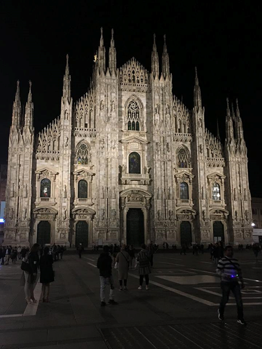

Milan
=====

Background
----------

Milan is located in North-Central Italy, and it has the most populous 
metropolitan area in Italy with 8,173,176 people. It is also the economic 
leading city of Italy. It hosts Italy's Stock Exchange, and if it became 
independent would be the 21st richest country in the world. Milan has been 
named the fashion capital of the world, and hosts many incredible tourist 
attractions. With Milan being an economic leader, it is no surprise that it 
houses 11% of the national total enrolled students. Milan hosts two successful 
European football teams, an Italian basketball team, and many luxury hotels as 
well.

Attractions
-----------
Some of the main tourist attractions include the Milan Cathedral (Seen above), 
the Sforza Castle, and Santa Maria delle Grazie. The Milan Cathedral is the 
third largest church in the world, and is located in the central part of the 
city. Construction began in 1386, and it had things added to it until the mid 
1800s. The `Sforza Castle <https://www.milanocastello.it/en>`_ is located less 
than a mile away from the Milan Cathedral. It is a massive fortress that was 
originally constructed in the 1300s. It houses many museums, including art by 
Leanardo Da Vinci and Michelangelo. Santa Maria delle Grazie is a gothic church 
just North-West of the city center. It houses Leanardo Da Vinci's famous 
painting called *The Last Supper*.

