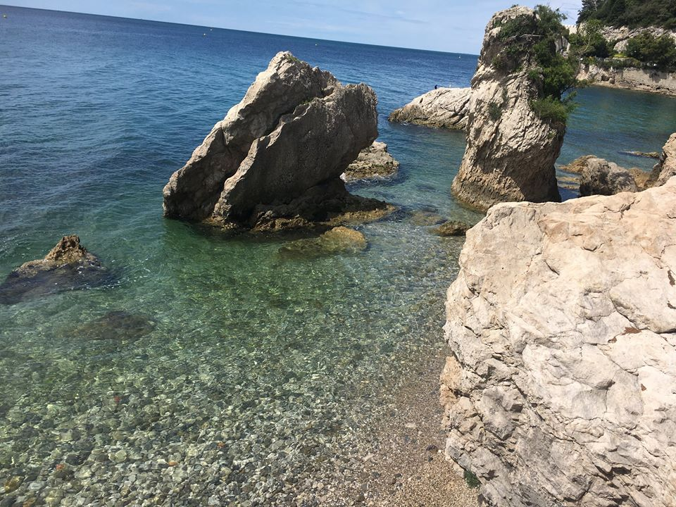

Trieste
=======

Background
----------

Trieste is a city in northeastern Italy with a population of 205,000. Due to its proximity to other nations and regions, Trieste has been influenced over the years by various other cultures and civilizations. The city is one of the richest regions of Italy and has been a great center for shipping. Trieste has a pleasing mix of historical buildings and Piazzas, stunning seaside locations and interesting Museums that make it a premier tourist destination in this region of Italy.

Location
--------

Trieste is located in northeastern Italy.

Top 5 Things to do in Trieste
-----------------------------

* **Trieste Harbor** - The port and harbor of Trieste is truly impressive and rightly so as it serves as the cities principal form of economy. The main harbor area is filled with beautiful yachts, sailing boats and fishing boats.
* **Piazza Unita Italia** - This colossal square lies at the forefront of the historic old town and faces out towards the Adriatic Sea. The Piazza Unita Italia is known as the largest square situated next to the sea in Europe. There are impressive monuments, buildings and statues placed at various intervals in the square.
* **Trieste Roman Theatre** - The ancient structure is in fantastic condition and the original seating and stage area is still visible together with various columns and walls. When walking through the city of Trieste, this theatre is a must see and is a fine example of Roman architecture.
* **Castle of Saint Giusto** - The Castle of Saint Giusto is an ancient structure that has stood for many years and is one of the cities icons. Inside the main keep there is a display of artifacts and information about the history of the castle including military banners, coats of arms and an armory with a wide variety of ancient weaponry.
* **Grotta Gigante** - The Grotta Gigante is a gigantic cave. It is one of the largest tourist caves in the world. Guided tours are available of this immense natural phenomenon.

This is a link to the official `Italy Tourism Site <http://www.italia.it/en/home.html>`_.

.. Link Code