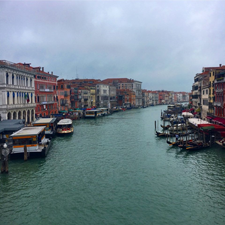

Venice
========

Background
----------

The history of Venice begins around 400 A.D. People came from the nearby Italian mainland, fleeing from savage Barbarians who conquered Italy after the fall of the Roman Empire. The population of Venice is around 250,000 and it lies on 117 small islands that are connected by a series of bridges and separated by a network of canals. Venice is one of the most dazzlingly beautiful cities in the world, where architectural and artistic treasures can be found.

Location
--------

Venice is a city in northeastern Italy and the capital of the Veneto region.

Top 5 things to do in Venice
----------------------------

* **St. Mark’s Basilica** - Created in 1092 and located in the Piazza San Marco, St. Mark’s Basilica is one of the most important   religious buildings in Northern Italy. This church shows off ornate detail, sculptures and artwork of the front facade, to the beautifully painted frescos and Byzantine works of art on the inside of the domed ceiling.

* **St. Mark’s Square** - Located on the grand canal, St. Mark’s Square is the most famous piazza in Venice. This square is a truly spectacular place to visit and is surrounded by a series of ornate buildings with arched walkways that frame it perfectly

* **Canale Grande** - The largest canal that connects the various islands that make up Venice is the Canale Grande. This monumental canal is more like a river and it passes from one side of Venice to the other and snakes through the center in a large S bend shape.

* **Ponte di Rialto** - This bridge spans the impressive Canale Grande and is undoubtedly the most famous and iconic. The detail of the bridge is simply beautiful and its symmetry perfectly frames the Canale Grande.

* **Gallerie dell’Accademia** - This museum hosts a fine collection of pre-19th century art and features works by artists such as Bellini, Canaletto and Titan.

.. List Code

This is a link to the offical `Italy Tourism Site <http://www.italia.it/en/home.html>`_.

.. Link Code